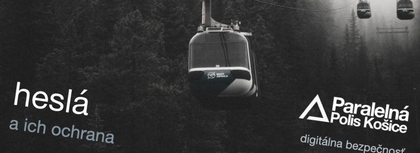

What are the current recommendations on how to handle passwords securely from the user perspective? Presentation is in Slovak language.

[Presentation slides](https://docs.google.com/presentation/d/18a_c3XuInO9LK6_IGx1Vnst8qu5KF6pw2S3oPNKryZ4). Read also about [Paralelná Polis](https://www.paralelnapoliskosice.sk/).

